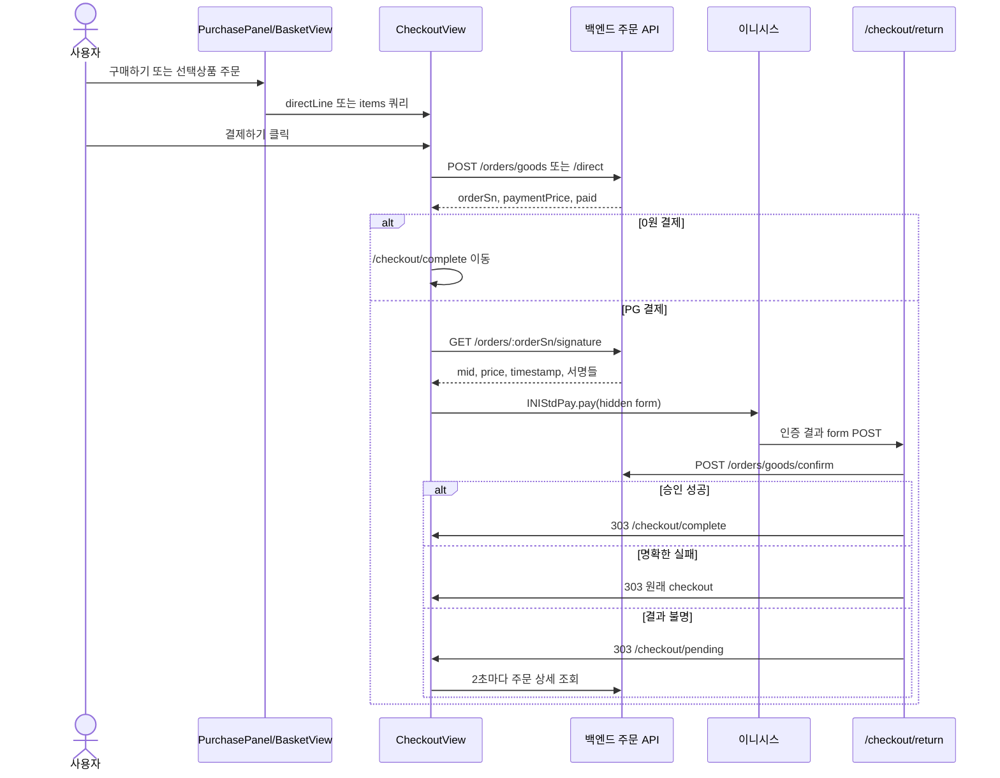

# 이니시스 결제 흐름: 결제를 처음 보는 사람을 위한 설명

이 문서는 일반적인 결제 예제가 아니라 현재 프로젝트 코드를 따라간 학습 문서다. 파일과 함수 이름은 모두 저장소에서 확인했다. 백엔드 내부처럼 이 저장소에서 볼 수 없는 내용은 **확인 필요**로 표시한다.

처음 읽을 때는 아래 순서만 읽어도 된다.

```text
0장: 결제가 무엇인지 이해
  → 0-10: 현재 프로젝트의 가장 짧은 호출 순서
  → 4장: 실제 결제 전체 흐름
  → 5장: 데이터가 어떻게 변하는지 확인
```

나머지는 기능을 수정할 때 찾아보는 참고 자료다.

---

## 0. 결제 시스템을 전혀 모르는 상태에서 시작하기

### 0-1. 결제에는 네 명이 참여한다

이 프로젝트의 결제를 이해하려면 먼저 참여자를 구분해야 한다.

| 참여자     | 현재 프로젝트에서 해당하는 것   | 하는 일                                               |
| ---------- | ------------------------------- | ----------------------------------------------------- |
| 사용자     | 결제 버튼을 누르는 사람         | 상품, 배송지, 결제수단을 선택한다                     |
| 프론트엔드 | 지금 보고 있는 Next.js 프로젝트 | 화면을 보여주고 데이터를 전달한다                     |
| 백엔드     | 별도의 API 서버                 | 가격 계산, 주문 생성, 서명 생성, 최종 승인을 담당한다 |
| PG사       | 이니시스                        | 카드·은행·통신사와 실제 결제를 연결한다               |

PG는 Payment Gateway의 줄임말이다. 쉽게 말하면 우리 쇼핑몰과 카드사 사이의 결제 중개인이다.

중요한 원칙은 다음과 같다.

> 프론트엔드는 사용자가 보는 화면이므로 조작될 수 있다. 최종 금액과 결제 성공 여부는 백엔드가 판단해야 한다.

### 0-2. 주문과 결제는 같은 것이 아니다

쇼핑몰에서 “결제하기”를 누른다고 곧바로 카드 결제가 시작되는 것은 아니다.

먼저 우리 백엔드에 주문을 만든다.

```text
상품과 배송지 선택
  → 우리 백엔드에 주문 생성
  → 주문번호 orderSn 발급
  → 그 주문번호로 이니시스 결제 시작
```

택배에 비유하면 다음과 같다.

- 주문 생성: 택배 송장을 먼저 만드는 것
- 결제: 그 송장에 적힌 물건값을 실제로 지불하는 것

주문을 먼저 만드는 이유는 “어떤 상품의 어떤 금액을 결제하는지”를 백엔드가 미리 확정해야 하기 때문이다.

### 0-3. 프론트에서 계산한 금액을 그대로 믿으면 안 되는 이유

프론트 화면에서 상품 가격이 10,000원이라고 계산되었다고 하자.

개발자 도구를 사용할 수 있는 사람은 브라우저 자바스크립트 값을 100원으로 바꿀 수도 있다. 그래서 프론트의 `total`만 믿고 결제하면 안 된다.

현재 프로젝트는 프론트 계산값을 `clientTotalPrice`라는 이름으로 서버에 보낸다.

```ts
{
  clientTotalPrice: 10000;
}
```

이 값의 의미는 “프론트에서는 10,000원으로 계산했습니다”이다.

백엔드는 상품, 옵션, 수량, 배송비, 포인트 등을 다시 계산하고 프론트 값과 대조해야 한다. 이후 이니시스에 보낼 금액도 서버의 서명 응답에서 다시 받는다.

### 0-4. 결제 요청, 인증, 승인은 서로 다른 단계다

결제에서 가장 헷갈리는 부분이다.

```text
결제 요청
 → 결제창을 열고 주문번호와 금액을 이니시스에 전달

결제 인증
 → 사용자가 카드 비밀번호나 앱카드로 본인 확인

결제 승인
 → 우리 백엔드가 이니시스와 통신해 금액을 최종 확정
```

인증 성공은 결제 최종 성공이 아니다.

예를 들어 사용자가 카드 앱에서 본인 확인에는 성공했지만, 이후 서버가 확인한 주문 금액이 다르면 승인을 거절해야 한다.

그래서 현재 코드는 다음 조건에서만 완료 페이지로 이동한다.

```text
사용자 인증 성공
그리고
백엔드 confirm 성공
```

### 0-5. 서명이란 무엇인가?

서명은 주문번호와 금액에 찍는 위조 방지 도장이다.

예를 들어 다음 값이 있다고 하자.

```text
주문번호: ORDER-100
금액: 10,000원
시간: 1234567890
```

백엔드는 비밀키를 이용해 이 값들의 해시를 만든다.

```text
ORDER-100 + 10000 + 1234567890 + 비밀키
  → SHA-256 같은 해시 계산
  → a8f3... 형태의 signature
```

해시는 여러 값을 일정한 길이의 복잡한 문자열로 바꾸는 계산이다. 입력값이 조금만 달라져도 결과가 크게 달라진다.

비밀키를 가진 백엔드만 올바른 서명을 만들 수 있어야 한다. 프론트에는 비밀키를 두면 안 된다.

현재 프론트는 서명을 직접 만들지 않는다. 다음 API에서 결과만 받는다.

```text
GET /orders/{orderSn}/signature
```

### 0-6. 브라우저, 프론트 서버, 백엔드 서버를 구분하기

현재 프로젝트는 Next.js이므로 프론트 코드 안에도 두 실행 장소가 있다.

| 실행 장소       | 예                          | 할 수 있는 일                               |
| --------------- | --------------------------- | ------------------------------------------- |
| 사용자 브라우저 | `CheckoutView`, `inicis.ts` | 버튼 처리, SDK 실행, 결제창 열기            |
| Next.js 서버    | `/checkout/return/route.ts` | 이니시스 POST를 받아 백엔드로 안전하게 중계 |
| 백엔드 API 서버 | `/orders/goods/confirm`     | 이니시스 승인, 금액 확인, DB 상태 저장      |

`CheckoutView`와 `inicis.ts`에는 `"use client"`가 있으므로 브라우저에서 실행된다.

`src/app/(detail)/checkout/return/route.ts`는 브라우저 화면 컴포넌트가 아니라 Next.js 서버의 Route Handler다.

### 0-7. hidden form은 무엇인가?

HTML form은 여러 입력값을 다른 주소로 전송하는 기능이다.

일반적인 form은 다음처럼 보인다.

```html
<form method="post">
  <input name="price" value="10000" />
  <button>전송</button>
</form>
```

현재 프로젝트는 사용자가 직접 입력할 필요가 없으므로 보이지 않는 input을 자바스크립트로 만든다.

```html
<input type="hidden" name="price" value="10000" />
```

`launchInicisPay`가 `mid`, `oid`, `price`, `signature` 같은 값을 가진 hidden form을 만든다. 그 뒤 이니시스 SDK에 form ID를 전달한다.

```ts
window.INIStdPay.pay("inicisPayForm");
```

### 0-8. SDK는 무엇인가?

SDK는 외부 회사가 제공하는 기능 묶음이다.

이 프로젝트는 이니시스가 제공하는 다음 자바스크립트를 로드한다.

```text
https://stdpay.inicis.com/stdjs/INIStdPay.js
```

스크립트가 로드되면 브라우저에 `window.INIStdPay`가 생긴다. 우리 코드는 내부 결제창 구현을 직접 만들지 않고 `INIStdPay.pay()`를 호출한다.

### 0-9. returnUrl과 리디렉션이란 무엇인가?

사용자가 이니시스 결제창에서 인증을 끝내면 결과가 다시 우리 사이트로 돌아와야 한다.

그 돌아올 주소가 `returnUrl`이다.

```text
https://우리사이트/checkout/return
```

이니시스는 이 주소로 인증 결과를 form POST한다.

POST는 주소만 이동하는 것이 아니라 `authToken`, `resultCode` 같은 데이터를 본문에 함께 보내는 HTTP 방식이다.

일반 Next.js 페이지는 이 외부 POST를 직접 처리하기 어려우므로 Route Handler가 필요하다.

```text
src/app/(detail)/checkout/return/route.ts
```

Route Handler가 처리를 끝낸 뒤 브라우저를 다른 페이지로 보내는 것이 리디렉션이다.

```text
성공 → /checkout/complete
명확한 실패 → /checkout
결과를 모름 → /checkout/pending
```

### 0-10. 현재 프로젝트의 가장 짧은 호출 순서

```text
CheckoutView.handlePay
  ↓ 주문 body 생성
useCheckoutMutation
  ↓ mode에 따라 API 선택
checkoutGoods 또는 checkoutDirect
  ↓ 백엔드가 주문 생성
CheckoutResult.orderSn
  ↓
CheckoutView.startPgPayment(orderSn)
  ↓
getPaymentSignature(orderSn)
  ↓ 서버가 만든 금액과 서명 수신
launchInicisPay
  ↓ hidden form 생성
window.INIStdPay.pay
  ↓ 사용자가 이니시스에서 인증
/checkout/return의 POST
  ↓ 인증 결과를 받음
POST /orders/goods/confirm
  ↓ 백엔드가 최종 승인
/checkout/complete
```

이 문서의 나머지는 위 화살표를 실제 데이터와 코드로 풀어쓴 것이다.

---

## 1. 이 문서에서 이해할 내용

1. 장바구니 또는 바로 구매 상품을 `/checkout` 한 화면으로 모은다.
2. `handlePay`가 배송지·할인·결제수단을 모아 백엔드에 주문을 먼저 만든다.
3. 결제할 금액이 남으면 백엔드가 만든 서명을 받아 이니시스 결제창을 연다.
4. 이니시스 인증 결과를 `/checkout/return`이 받아 백엔드 승인 API로 전달한다.
5. 승인 성공만 완료 화면으로 보내고, 결과가 불명확하면 주문 상태를 확인한 뒤 판단한다.

## 2. 결제 관련 핵심 파일 지도

| 순서 | 파일                                                              | 주요 함수/컴포넌트                                        | 역할                                                             |
| ---- | ----------------------------------------------------------------- | --------------------------------------------------------- | ---------------------------------------------------------------- |
| 1    | `src/features/basket/components/BasketView.tsx`                   | `BasketView`                                              | 선택한 장바구니 번호를 `/checkout?items=...`로 보낸다.           |
| 1    | `src/features/goods/components/goodsdetail/PurchasePanel.tsx`     | `submitDirect`, `handleBuyNow`                            | 바로 구매 정보를 Zustand에 넣고 `/checkout?direct=1`로 이동한다. |
| 2    | `src/app/(detail)/checkout/page.tsx`                              | `CheckoutPage`                                            | URL을 해석하고 장바구니·프로필을 미리 조회한다.                  |
| 3    | `src/features/order/store/useCheckoutStore.ts`                    | `useCheckoutStore`                                        | 바로 구매용 `directLine`을 `sessionStorage`에 임시 보관한다.     |
| 4    | `src/features/order/components/checkout/CheckoutView.tsx`         | `handlePay`, `startPgPayment`                             | 결제 화면의 데이터 조립, 주문 생성, PG 시작을 담당한다.          |
| 5    | `src/features/order/queries/useCheckoutMutation.ts`               | `useCheckoutMutation`                                     | 장바구니/바로 구매 API를 `mode`로 나눈다.                        |
| 6    | `src/features/order/api/orderApi.ts`                              | `checkoutGoods`, `checkoutDirect`, `getPaymentSignature`  | 주문 생성 및 결제 서명 API를 호출한다.                           |
| 7    | `src/features/order/lib/inicis.ts`                                | `launchInicisPay`, `loadInicisSdk`                        | 숨은 폼을 만들고 `INIStdPay.pay()`를 호출한다.                   |
| 8    | `src/app/(detail)/checkout/return/route.ts`                       | `POST`                                                    | 인증 결과를 받고 백엔드 `/orders/goods/confirm`으로 중계한다.    |
| 9    | `src/features/order/components/checkout/PaymentPendingView.tsx`   | `PaymentPendingView`                                      | 승인 여부가 불명확할 때 최대 30초 동안 주문 상태를 확인한다.     |
| 10   | `src/features/order/components/checkout/CheckoutCompleteView.tsx` | `CheckoutCompleteView`                                    | `pay_success` 주문만 완료 화면에 표시하고 관련 캐시를 정리한다.  |
| 타입 | `src/features/order/types.ts`                                     | `CheckoutBaseInput`, `CheckoutResult`, `PaymentSignature` | 요청과 응답의 정확한 데이터 모양이다.                            |

## 3. 결제 전 알아야 하는 쉬운 개념

결제는 택배 접수와 비슷하다. 먼저 우리 쇼핑몰에서 송장인 **주문**을 만들고, 카드사 쪽에서 본인 확인인 **인증**을 한 뒤, 쇼핑몰 서버가 금액과 주문을 다시 확인해 **승인**한다.

- **주문 생성**: 상품, 수량, 배송지, 할인 사용액을 서버에 보내 `orderSn`을 받는 단계다. 아직 카드 결제가 끝난 것은 아니다.
- **결제 요청**: `oid`, `price`, 구매자 정보 등을 이니시스 결제창에 전달하는 단계다.
- **결제 인증**: 사용자가 카드번호, 앱카드, 비밀번호 등으로 본인임을 증명하는 단계다. 인증 성공도 최종 결제 성공과 같지 않다.
- **결제 승인**: 백엔드가 인증 토큰을 이니시스에 서버 간 요청으로 보내 실제 결제를 확정하는 단계다.
- **서명/해시**: 주문번호와 금액을 봉인한 도장이다. 이 프로젝트의 `signature`, `verification`, `mKey`는 백엔드가 생성한다. 프론트에서 만들지 않는다.
- **리디렉션과 `returnUrl`**: 인증이 끝난 브라우저가 결과를 들고 돌아올 주소다. 이 프로젝트에서는 `/checkout/return` Route Handler가 form POST를 받는다.
- **역할 분리**: 프론트는 입력과 화면 이동을 담당한다. 서버는 상품 가격 재계산, 주문 생성, 서명 생성, 결제 승인과 최종 상태 저장을 담당한다.

## 4. 전체 결제 흐름



1. **장바구니 시작점**
   - 파일: `src/features/basket/components/BasketView.tsx`
   - 처리: 개별 주문은 `/checkout?items=${item.idx}`, 선택 주문은 선택된 `idx`들을 쉼표로 연결한다.
   - 다음 데이터: 장바구니 항목 번호 목록. 상품 가격 전체를 URL로 보내지 않는다.

2. **바로 구매 시작점**
   - 파일: `src/features/goods/components/goodsdetail/PurchasePanel.tsx`
   - 함수: `submitDirect`
   - 처리: 상품, 옵션 조합, 수량, 화면 가격, DIY 이미지 key를 `DirectOrderLine`으로 만든다. `setDirectLine`으로 저장하고 `/checkout?direct=1`로 간다.
   - 다음 데이터: `useCheckoutStore`의 `directLine`. 이는 서버 주문이 아닌 임시 전달 상자다.

3. **결제 화면 진입**
   - 파일: `src/app/(detail)/checkout/page.tsx`
   - 함수: `CheckoutPage`
   - 입력: `items`, `direct`, `payError`, `cancelOrder` 검색 파라미터.
   - 처리: 로그인을 확인하고 basket/profile TanStack Query 데이터를 SSR에서 미리 채운다.

4. **화면용 주문 데이터 정규화**
   - 파일: `src/features/order/components/checkout/CheckoutView.tsx`
   - 컴포넌트: `CheckoutView`
   - 장바구니는 basket 캐시에서 `itemIdxs`에 해당하는 항목을 고른다. 바로 구매는 `directLine.items`를 읽는다. 둘 다 내부의 `CheckoutItemView[]` 모양으로 바뀐다.
   - `subtotal`, 쿠폰 할인, 서버가 미리 계산한 배송비, 포인트와 캐시를 합쳐 `total`을 만든다. 이 값은 화면 표시와 서버 대조용이며 최종 진실은 아니다.

5. **결제 버튼 검증과 주문 body 생성**
   - 함수: `handlePay`
   - 검사: 연속 클릭, 빈 상품, 구매 불가 장바구니 항목, 배송지, 배송비 계산 완료, 미지원 쿠폰.
   - 공통 `CheckoutBaseInput`에 `clientTotalPrice`, 배송지, 포인트/캐시, `payMethod`를 넣는다.
   - 바로 구매는 상품·옵션·DIY 데이터를 추가하고, 장바구니는 `basketItemIdxs`를 추가한다.

6. **백엔드 주문 생성**
   - 파일: `src/features/order/queries/useCheckoutMutation.ts`
   - 함수: `useCheckoutMutation`
   - `mode === "basket"`이면 `checkoutGoods`, 아니면 `checkoutDirect`를 부른다.
   - API: `POST /orders/goods` 또는 `POST /orders/goods/direct`.
   - 응답: `CheckoutResult { orderSn, paymentPrice, paid, deliveryPrice }`.

7. **0원과 PG 결제 분기**
   - `res.paid`가 참이면 포인트/캐시 전액 결제이므로 PG 없이 `/checkout/complete?orderSn=...`로 이동한다.
   - 아니면 `startPgPayment(res.orderSn)`을 실행한다.

8. **서명 조회와 결제창 호출**
   - `startPgPayment`가 `getPaymentSignature(orderSn)`을 호출한다.
   - 백엔드 응답의 `price`를 그대로 이니시스에 사용한다. 프론트의 `total`을 다시 넣지 않는다.
   - `launchInicisPay`가 SDK를 최초 한 번 로드하고 hidden form을 만든 뒤 `window.INIStdPay.pay("inicisPayForm")`을 호출한다.

9. **인증 결과와 승인 중계**
   - 파일: `src/app/(detail)/checkout/return/route.ts`
   - 함수: `POST`
   - `resultCode !== "0000"`이면 인증 실패/취소로 판단하고 승인 API를 부르지 않는다.
   - 성공이면 `authUrl`, `authToken`, `netCancelUrl`, `orderNumber` 등을 백엔드 `POST /orders/goods/confirm`으로 전달한다.
   - 백엔드 응답이 `res.ok && data.success`일 때만 완료 페이지로 간다.

10. **불명 상태 처리**
    - confirm이 5xx이거나 15초 내 응답하지 않으면 결제가 이미 승인됐을 가능성이 있다. 즉시 재결제시키지 않고 `/checkout/pending`으로 이동한다.
    - `usePaymentStatusQuery`가 2초마다 주문 상세를 조회한다. `pay_success`면 완료, `pay_fail`이면 재시도 버튼을 보여주고, 30초가 지나도 불명이면 주문내역 확인만 안내한다.

## 5. 실제 결제 데이터의 변화

| 단계            | 데이터                                                                 | 생성 위치                                    | 다음 사용처                                    |
| --------------- | ---------------------------------------------------------------------- | -------------------------------------------- | ---------------------------------------------- |
| 상품/옵션       | `BasketItem[]` 또는 `DirectOrderLine.items`                            | basket API 또는 `PurchasePanel.submitDirect` | `CheckoutView.items`                           |
| 수량/화면 가격  | `cnt`, `orgPrice`, `linePrice`                                         | 상품 상세/장바구니                           | 화면 합계 계산. 서버가 다시 계산함             |
| 배송지          | `DeliveryPreset` → `deliveryName`, `deliveryPost` 등                   | `CheckoutView`                               | 체크아웃 API                                   |
| 할인            | `usePoint`, `useCash`, `couponCode?`                                   | `CheckoutView.handlePay`                     | 체크아웃 API. 현재 쿠폰 결제는 화면에서 차단됨 |
| 주문 생성 요청  | `CheckoutGoodsInput` / `CheckoutDirectInput`                           | `handlePay`                                  | 주문 API                                       |
| 주문 생성 응답  | `orderSn`, `paymentPrice`, `paid`, `deliveryPrice`                     | 백엔드                                       | 0원 완료 또는 서명 조회                        |
| 이니시스 요청값 | `mid`, `oid`, `price`, `timestamp`, `signature`, `verification` 등     | 서버 서명 + 프론트 구매자 정보               | hidden form                                    |
| 인증 결과       | `resultCode`, `orderNumber`, `authUrl`, `authToken`, `netCancelUrl` 등 | 이니시스                                     | `/checkout/return` → 백엔드 confirm            |
| 최종 주문 상태  | `paymentMethod.status`                                                 | 백엔드 주문 상세                             | pending/complete 화면                          |

### 이니시스 필드 사전

| 필드           | 현재 값의 출처                   | 쉬운 뜻                                              |
| -------------- | -------------------------------- | ---------------------------------------------------- |
| `mid`          | `PaymentSignature.mid`           | 이니시스가 가맹점을 구분하는 ID                      |
| `oid`          | `PaymentSignature.orderSn`       | 이번 결제의 주문번호                                 |
| `price`        | `PaymentSignature.price`         | 서버가 확정해 서명한 결제 금액                       |
| `timestamp`    | `PaymentSignature.timestamp`     | 서명이 만들어진 시점                                 |
| `signature`    | 백엔드                           | `oid`, `price`, `timestamp`를 묶은 서명              |
| `verification` | 백엔드                           | `use_chkfake=Y`와 함께 보내는 추가 위조 검증값       |
| `mKey`         | 백엔드                           | 가맹점 키에서 만든 검증용 해시값                     |
| `goodname`     | 첫 상품명 + 나머지 건수          | 결제창에 표시할 상품명                               |
| `buyername`    | 선택 배송지 이름                 | 구매자 이름 역할. 코드 변수는 `buyername` 소문자이다 |
| `buyertel`     | 선택 배송지 전화번호             | 구매자 연락처                                        |
| `buyeremail`   | 로그인 프로필 이메일             | 구매자 이메일                                        |
| `gopaymethod`  | `PAY_METHODS[].gopay`            | `Card`, `DirectBank`, `HPP` 중 결제 방식             |
| `returnUrl`    | 현재 origin + `/checkout/return` | 인증 결과를 POST할 주소                              |
| `closeUrl`     | 현재 origin + `/checkout/close`  | 사용자가 결제창을 닫았을 때 iframe이 도착할 주소     |
| `merchantData` | 장바구니/바로 구매 checkout 경로 | 실패 시 돌아갈 화면. 외부 입력으로 보고 재검증함     |

주의: 요청에 나온 `buyerName`, `buyerTel`, `buyerEmail`이라는 camelCase 이름은 현재 코드에 없다. 실제 이니시스 form 필드는 각각 `buyername`, `buyertel`, `buyeremail`이다.

### 5-1. 10,000원 상품 하나가 결제되는 동안 데이터가 변하는 과정

아래 값은 이해를 위한 마스킹 예시다. 실제 사용자 개인정보나 키가 아니다.

#### 단계 A: 상품 상세에서 바로 구매 버튼을 누른다

파일: `src/features/goods/components/goodsdetail/PurchasePanel.tsx`

함수: `submitDirect`

상품 상세 화면에는 다음과 같은 정보가 있다고 가정한다.

```text
상품번호: GOODS-100
상품명: 테스트 머그컵
옵션: 흰색
수량: 1
화면 계산 가격: 10,000원
```

`submitDirect`는 이 정보를 `DirectOrderLine` 모양으로 만든다.

```ts
{
  productSn: "GOODS-100",
  productName: "테스트 머그컵",
  items: [{
    productOption: "COLOR_WHITE",
    optionLabel: "색상: 흰색",
    cnt: 1,
    linePrice: 10000,
    orgPrice: 10000
  }]
}
```

이것은 아직 서버 주문이 아니다. 상품 상세에서 결제 화면으로 데이터를 옮기기 위한 임시 프론트 상태다.

```text
PurchasePanel.submitDirect
  → useCheckoutStore.setDirectLine
  → sessionStorage의 omy-checkout
  → /checkout?direct=1 이동
```

#### 단계 B: CheckoutView가 화면용 데이터로 바꾼다

파일: `src/features/order/components/checkout/CheckoutView.tsx`

`CheckoutView`는 `directLine.items`를 읽어 내부 표시용 `CheckoutItemView[]`로 바꾼다.

```ts
[
  {
    key: "direct-0",
    name: "테스트 머그컵",
    optionLabel: "색상: 흰색",
    cnt: 1,
    orgPrice: 10000,
    finalPrice: 10000,
  },
];
```

이 데이터는 주문 상품 목록과 화면 합계를 보여주기 편한 모양이다.

사용자가 배송지를 선택했다고 가정한다.

```text
받는 사람: 홍**
우편번호: 0****
주소: 서울시 ***
전화번호: 010-****-****
배송비: 3,000원
```

그러면 화면 계산은 다음과 같다.

```text
상품 합계 subtotal = 10,000
배송비             = 3,000
포인트 사용         = 0
캐시 사용           = 0
최종 화면 total     = 13,000
```

#### 단계 C: 결제 버튼이 `handlePay`를 실행한다

`handlePay`는 먼저 입력값을 검사한다.

```text
주문 상품이 있는가?
구매 불가능한 상품은 없는가?
배송지를 선택했는가?
배송비 계산이 끝났는가?
결제 버튼이 이미 처리 중인가?
```

검사를 통과하면 공통 body인 `base`를 만든다.

```ts
{
  clientTotalPrice: 13000,
  deliveryPrice: 3000,
  deliveryName: "홍**",
  deliveryPost: "0****",
  deliveryAddr1: "서울시 ***",
  deliveryPhone: "010-****-****",
  payMethod: "CARD"
}
```

바로 구매 정보까지 합치면 `CheckoutDirectInput`이 된다.

```ts
{
  clientTotalPrice: 13000,
  deliveryPrice: 3000,
  deliveryName: "홍**",
  deliveryPost: "0****",
  deliveryAddr1: "서울시 ***",
  deliveryPhone: "010-****-****",
  payMethod: "CARD",
  productSn: "GOODS-100",
  items: [{
    productOption: "COLOR_WHITE",
    cnt: 1
  }]
}
```

중요한 변화가 있다.

- 상품 상세의 `linePrice`는 주문 API body의 직접 구매 `items`에 들어가지 않는다.
- 서버에 보내는 상품 라인에는 상품번호, 옵션, 수량이 들어간다.
- `clientTotalPrice`는 프론트 계산 결과와 서버 계산 결과를 대조하는 용도다.

#### 단계 D: 주문 생성 API를 호출한다

`handlePay`는 다음 형태로 mutation을 호출한다.

```ts
{
  mode: "direct",
  body: CheckoutDirectInput
}
```

`useCheckoutMutation`은 `mode`를 보고 `checkoutDirect`를 선택한다.

```text
POST /orders/goods/direct
```

장바구니라면 이 부분만 다르다.

```text
mode: "basket"
POST /orders/goods
body: { ...공통정보, basketItemIdxs: [1, 2] }
```

두 흐름은 주문 생성 응답부터 다시 같아진다.

#### 단계 E: 백엔드가 주문 생성 결과를 돌려준다

응답 타입은 `CheckoutResult`다.

```ts
{
  orderSn: "ORDER-100",
  paymentPrice: 13000,
  paid: false,
  deliveryPrice: 3000
}
```

각 값의 뜻은 다음과 같다.

| 값              | 뜻                                     |
| --------------- | -------------------------------------- |
| `orderSn`       | 백엔드가 만든 주문번호                 |
| `paymentPrice`  | 백엔드가 계산한 실제 PG 결제 대상 금액 |
| `paid`          | PG 없이 이미 결제가 끝났는지 여부      |
| `deliveryPrice` | 백엔드가 확정한 배송비                 |

포인트와 캐시로 전액 결제되어 `paid: true`라면 이니시스를 열지 않고 완료 페이지로 이동한다.

지금 예시는 `paid: false`이므로 `startPgPayment("ORDER-100")`을 실행한다.

#### 단계 F: 결제 서명 API를 호출한다

```text
GET /orders/ORDER-100/signature
```

응답 타입은 `PaymentSignature`다.

```ts
{
  orderSn: "ORDER-100",
  price: 13000,
  mid: "가맹점ID-마스킹",
  timestamp: "시간값-마스킹",
  signature: "서명값-마스킹",
  verification: "검증값-마스킹",
  mKey: "해시값-마스킹"
}
```

여기서 이니시스에 보낼 금액은 `CheckoutView`가 계산했던 `total`을 다시 사용하는 것이 아니라 `PaymentSignature.price`를 사용한다.

#### 단계 G: 프론트 정보와 서버 서명을 합친다

`startPgPayment`가 `launchInicisPay`에 다음 정보를 전달한다.

```ts
{
  sig: PaymentSignature,
  gopaymethod: "Card",
  goodname: "테스트 머그컵",
  buyername: "홍**",
  buyertel: "010-****-****",
  buyeremail: "u***@example.com",
  returnUrl: "https://우리사이트/checkout/return",
  closeUrl: "https://우리사이트/checkout/close",
  merchantData: "/checkout?direct=1"
}
```

데이터 출처를 구분하면 다음과 같다.

| 데이터               | 출처                            |
| -------------------- | ------------------------------- |
| 주문번호, 금액, 서명 | 백엔드 서명 API                 |
| 상품명               | `CheckoutView.items`            |
| 구매자 이름·전화     | 선택 배송지                     |
| 구매자 이메일        | 로그인 프로필                   |
| 결제수단             | 사용자가 선택한 `PAY_METHODS`   |
| 복귀 URL             | 프론트에서 현재 origin으로 생성 |

#### 단계 H: `launchInicisPay`가 hidden form을 만든다

파일: `src/features/order/lib/inicis.ts`

함수: `launchInicisPay`

앞의 값은 이니시스가 요구하는 필드 이름으로 바뀐다.

```ts
{
  version: "1.0",
  gopaymethod: "Card",
  mid: "가맹점ID-마스킹",
  oid: "ORDER-100",
  price: "13000",
  timestamp: "시간값-마스킹",
  signature: "서명값-마스킹",
  verification: "검증값-마스킹",
  mKey: "해시값-마스킹",
  goodname: "테스트 머그컵",
  buyername: "홍**",
  buyertel: "010-****-****",
  returnUrl: "https://우리사이트/checkout/return"
}
```

`price`가 숫자 `13000`에서 문자열 `"13000"`으로 바뀌는 이유는 HTML input의 `value`가 문자열이기 때문이다.

각 항목마다 다음 input을 만든다.

```html
<input type="hidden" name="price" value="13000" />
```

마지막으로 다음 함수를 호출한다.

```ts
window.INIStdPay.pay("inicisPayForm");
```

이 시점에 이니시스 결제창이 열린다.

#### 단계 I: 사용자가 이니시스에서 인증한다

사용자가 카드 앱이나 비밀번호 인증을 끝내면 이니시스가 `returnUrl`로 form POST한다.

성공한 인증 결과는 대략 다음 종류의 값을 가진다.

```ts
{
  resultCode: "0000",
  orderNumber: "ORDER-100",
  authUrl: "이니시스 승인요청 주소",
  authToken: "인증 토큰-마스킹",
  netCancelUrl: "망취소 주소",
  payMethod: "Card"
}
```

이 값은 React의 `CheckoutView`로 돌아가는 것이 아니다.

다음 Next.js 서버 파일의 `POST` 함수가 받는다.

```text
src/app/(detail)/checkout/return/route.ts
```

#### 단계 J: Route Handler가 인증 성공을 확인한다

```ts
const resultCode = field("resultCode");

if (resultCode !== "0000") {
  return backTo(/* 결제 화면 */);
}
```

`resultCode !== "0000"`이면 사용자가 취소했거나 인증에 실패한 것이므로 승인 API를 호출하지 않는다.

`resultCode === "0000"`이면 인증만 성공한 것이다. 아직 최종 결제 완료가 아니다.

#### 단계 K: 백엔드 confirm으로 인증 결과를 전달한다

Route Handler는 다음 API를 호출한다.

```text
POST /orders/goods/confirm
```

body에는 다음 데이터가 들어간다.

```ts
{
  resultCode: "0000",
  orderNumber: "ORDER-100",
  authUrl: "이니시스 승인요청 주소",
  authToken: "인증 토큰-마스킹",
  netCancelUrl: "망취소 주소",
  payMethod: "Card"
}
```

프론트 저장소에서 확인할 수 있는 것은 여기까지다. 백엔드 내부에서는 주문번호와 금액을 검증하고 이니시스로 최종 승인 요청을 보내는 것으로 코드 계약과 주석에 나타나 있다.

#### 단계 L: 최종 결과에 따라 이동한다

승인 성공 응답 예시:

```ts
{
  success: true,
  orderSn: "ORDER-100"
}
```

그러면 브라우저를 다음 주소로 보낸다.

```text
/checkout/complete?orderSn=ORDER-100
```

전체 데이터 변화를 한 줄로 정리하면 다음과 같다.

```text
상품·옵션·수량
 → DirectOrderLine 또는 장바구니 idx
 → CheckoutDirectInput 또는 CheckoutGoodsInput
 → CheckoutResult의 orderSn
 → PaymentSignature
 → 이니시스 hidden form
 → 인증 결과 authToken
 → 백엔드 confirm body
 → pay_success 주문
 → 완료 페이지
```

## 6. 핵심 코드 따라 읽기

### 6.1 버튼 클릭: 두 입력을 하나의 mutation으로

파일: `src/features/order/components/checkout/CheckoutView.tsx`, 함수: `handlePay`

```tsx
checkout.mutate(
    direct && directLine
        ? { mode: "direct", body: { ...base, productSn: directLine.productSn, items: /* ... */ } }
        : { mode: "basket", body: { ...base, basketItemIdxs: itemIdxs } },
    { onSuccess: (res) => { /* 0원 또는 PG 분기 */ } },
);
```

`base`까지는 배송지와 결제 정보가 같다. 다른 부분만 `mode`와 body에 붙인다. 그래서 주문 생성 뒤 흐름은 완전히 합쳐진다.

### 6.2 서버 서명을 받아 PG 시작

```tsx
const sig = await getPaymentSignature(orderSn);
await launchInicisPay({
  sig,
  gopaymethod: payMethod.gopay,
  returnUrl: `${window.location.origin}/checkout/return`,
  closeUrl: `${window.location.origin}/checkout/close`,
  /* 구매자와 상품 정보 */
});
```

핵심은 `sig.price`를 사용한다는 점이다. 화면 계산 금액으로 새 서명을 만들지 않는다.

### 6.3 숨은 form과 SDK

파일: `src/features/order/lib/inicis.ts`, 함수: `launchInicisPay`

```ts
const fields = {
  mid: params.sig.mid,
  oid: params.sig.orderSn,
  price: String(params.sig.price),
  signature: params.sig.signature,
  use_chkfake: "Y",
  verification: params.sig.verification,
};
window.INIStdPay.pay(FORM_ID);
```

사용자에게 보이지 않는 `<form>`의 각 값을 `<input type="hidden">`으로 만든다. SDK는 폼 ID를 받아 결제 오버레이를 연다.

### 6.4 인증과 승인은 별개

파일: `src/app/(detail)/checkout/return/route.ts`, 함수: `POST`

```ts
if (resultCode !== "0000") return backTo(/* ... */);
const res = await fetch(`${SERVER_API_BASE}/orders/goods/confirm`, {
  method: "POST",
  headers: { "Content-Type": "application/json" },
  body: JSON.stringify(body),
});
if (res.ok && data.success) return toComplete(data.orderSn ?? orderNumber);
```

`0000`은 인증 통과다. 그 뒤 백엔드 confirm까지 성공해야 최종 완료다.

## 7. 장바구니 구매와 바로 구매 비교

| 구분           | 장바구니 구매                              | 바로 구매                                   |
| -------------- | ------------------------------------------ | ------------------------------------------- |
| 시작           | `BasketView`                               | `PurchasePanel.submitDirect`                |
| 화면 전달      | `/checkout?items=1,2`                      | Zustand `directLine` + `/checkout?direct=1` |
| 임시 저장      | 서버 장바구니                              | `sessionStorage`의 `omy-checkout`           |
| 주문 body 핵심 | `basketItemIdxs`                           | `productSn`, `items`, DIY 이미지/작품 필드  |
| 주문 API       | `POST /orders/goods`                       | `POST /orders/goods/direct`                 |
| 합쳐지는 지점  | `useCheckoutMutation`의 성공 응답부터 동일 | 동일                                        |
| 후속           | `orderSn` → 0원 또는 서명/PG               | 동일                                        |

바로 구매의 화면용 `linePrice`를 서버가 그대로 믿는 구조가 아니다. 실제 주문 API는 상품 식별자·옵션·수량과 `clientTotalPrice`를 받고 서버가 다시 산출한다.

## 8. 성공·실패·취소 처리

| 상황                    | 판정 코드                          | 처리                                                      |
| ----------------------- | ---------------------------------- | --------------------------------------------------------- |
| 0원 결제                | `CheckoutResult.paid`              | PG 없이 `/checkout/complete`                              |
| 인증 성공 + 승인 성공   | confirm의 `res.ok && data.success` | `/checkout/complete`                                      |
| 사용자가 인증 취소/실패 | `resultCode !== "0000"`            | 원래 checkout으로 복귀, 임시 주문 자동 취소 요청          |
| 승인 명확한 4xx 실패    | confirm 4xx                        | 백엔드 망취소 후 checkout 복귀                            |
| 승인 결과 불명          | confirm 5xx, 통신 실패, 15초 초과  | `/checkout/pending`, 재결제 금지, 상태 폴링               |
| 결제창만 닫음           | `/checkout/close`                  | 부모 iframe의 `INIStdPay.viewOff()` 또는 `/checkout` 이동 |
| 상태 폴링 성공          | `pay_success`                      | 완료로 이동                                               |
| 상태 폴링 실패          | `pay_fail`                         | 재결제 버튼 허용                                          |

**주의해서 볼 부분**

- `startPgPayment` 설명대로 결제창만 닫은 pending 주문의 정리는 백엔드 정책에 의존하며 코드 주석에 TODO가 있다.
- 쿠폰 목록에 전송용 `code`가 없어 현재 쿠폰 선택 상태에서는 결제를 차단한다.
- `buyername`은 실제 구매자 본인 이름이 아니라 선택한 배송지의 `deliveryName`이다. 업무 규칙이 이것을 의도했는지는 확인이 필요하다.

## 9. 보안 관점에서 꼭 알아야 할 부분

| 점검                     | 코드에서 확인한 근거                                                                                                         | 판단 범위                                                 |
| ------------------------ | ---------------------------------------------------------------------------------------------------------------------------- | --------------------------------------------------------- |
| 프론트 금액만 신뢰하는가 | `clientTotalPrice`는 서버 대조용이고 서명 응답의 `price`로 PG를 연다. API 주석은 서버가 가격·배송비를 재산출한다고 명시한다. | 백엔드 실제 산식은 이 저장소에서 확인 불가                |
| 주문번호 중복 방지       | `payLockRef`와 pending state가 같은 화면의 더블클릭을 막고, 주문번호는 서버가 반환한다.                                      | 서버 DB unique/idempotency는 확인 불가                    |
| 서명 위치                | `getPaymentSignature` 응답으로만 받고 프론트에는 signKey 생성 코드가 없다.                                                   | 적절한 방향. 백엔드 보관 방식은 확인 불가                 |
| 승인 재검증              | `/checkout/return`이 백엔드 confirm으로 인증 결과를 전달한다. 완료는 confirm 성공만 허용한다.                                | confirm 내부의 금액 대조와 이니시스 승인 요청은 확인 불가 |
| 키 노출                  | 프론트에는 `mid`, 해시 결과가 전달되지만 signKey 원문은 보이지 않는다.                                                       | 환경 변수와 백엔드 설정은 별도 확인 필요                  |
| 중복 결제                | 불명 상태에서 재결제시키지 않고 상태를 폴링한다. `payLockRef`도 있다.                                                        | 여러 탭·서버 중복 요청의 idempotency는 확인 불가          |
| open redirect            | `merchantData`는 `/checkout`으로 시작하고 `//`가 없는지 확인한다.                                                            | 현재 Route Handler 범위에서 방어 확인                     |
| 민감 인증값              | `authToken`은 서버 Route Handler에서 백엔드로 중계하며 브라우저 컴포넌트가 읽지 않는다. 로그에도 넣지 않는다.                | 서버 로그/백엔드 로그는 확인 불가                         |

보안은 프론트 코드만 보고 “완전하다”고 결론 내릴 수 없다. 특히 가격 대조, 주문번호 유일성, 승인 idempotency, `netCancel`은 백엔드 코드를 함께 검토해야 한다.

## 10. 내가 직접 기능을 수정할 때 보는 순서

### 결제수단을 추가할 때

1. `src/features/order/lib/payMethods.ts`의 `PayMethodDef`, `PAY_METHODS`
2. `src/features/order/types.ts`의 `CheckoutBaseInput.payMethod`
3. `CheckoutView.handlePay`가 저장하는 값과 `startPgPayment`의 `gopaymethod`
4. `inicis.ts`의 `acceptmethod` 등 수단별 필드
5. 백엔드 주문 DTO, 이니시스 가맹점 설정

### 주문 데이터 필드를 추가할 때

1. `src/features/order/types.ts` 요청 타입
2. `CheckoutView.handlePay`의 `base` 또는 direct body
3. `orderApi.ts`의 endpoint 계약
4. 장바구니/바로 구매 중 어디서 최초 값이 생기는지
5. 백엔드 DTO와 서버 검증

### 완료 화면을 바꿀 때

1. `CheckoutCompleteView.tsx`
2. `checkout/complete/page.tsx`
3. 성공 이동을 만드는 `CheckoutView`, `checkout/return/route.ts`, `PaymentPendingView`
4. 성공 후 basket/profile 캐시 정리 코드

### 실패 처리나 재시도를 바꿀 때

1. `checkout/return/route.ts`의 세 분기
2. `PaymentPendingView.tsx`
3. `usePaymentStatusQuery.ts`
4. `cancelAbandonedOrder`와 백엔드 결제 상태 정의

## 11. 이해도 확인 질문

1. **결제 버튼을 누르면 처음 실행되는 핵심 함수는?** `CheckoutView.handlePay`.
2. **주문번호는 프론트가 만드는가?** 아니다. 주문 생성 API의 `CheckoutResult.orderSn`으로 받는다.
3. **장바구니와 바로 구매는 어디서 합쳐지는가?** `useCheckoutMutation`의 주문 생성 결과 이후다.
4. **화면의 `total`이 최종 금액인가?** 아니다. 서버 대조용이고 서버가 재산출한다.
5. **PG에 보내는 금액은 어디서 오는가?** `getPaymentSignature`가 반환한 `PaymentSignature.price`.
6. **`resultCode === "0000"`이면 결제가 끝났는가?** 아니다. 인증 성공이며 백엔드 승인이 남았다.
7. **승인 결과를 모르는데 왜 즉시 재결제시키지 않는가?** 이미 승인됐을 수 있어 이중 결제를 막기 위해서다.
8. **0원 결제도 이니시스를 여는가?** 아니다. `res.paid`이면 곧바로 완료로 간다.
9. **signKey 원문은 프론트에 있는가?** 확인된 코드에는 없다. 서버가 서명 결과만 준다.
10. **완료 화면은 무엇을 다시 확인하는가?** 주문 상세의 `paymentMethod.status === "pay_success"`인지 확인한다.

## 12. 확인하지 못한 부분

> 확인 필요: 백엔드 `/orders/goods`, `/orders/goods/direct`, `/orders/:orderSn/signature`, `/orders/goods/confirm`의 내부 구현은 현재 프론트엔드 저장소에 없다.

따라서 다음 항목은 이 저장소만으로 확정할 수 없다.

- 서버의 실제 상품가·배송비·할인 재계산식과 `TOTAL_MISMATCH` 비교 방식
- `signature`, `verification`, `mKey` 생성에 쓰는 비밀키 보관 방식
- 이니시스 승인 요청 및 `netCancel`의 상세 구현
- 주문번호 DB 유일 제약과 여러 탭/재전송에 대한 idempotency
- 결제창만 닫고 남은 `payment_wait` 주문의 서버 정리 주기
- 실제 이니시스 관리자 페이지의 허용 도메인, MID, 결제수단 설정
- 현재 코드 주석이 참조하는 백엔드 실측 결과의 운영 환경 동일 여부
