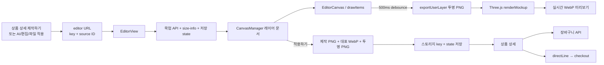

# Canvas + Three.js 상품 이미지 에디터 흐름

이 문서는 현재 프로젝트의 상품 편집기를 “그림판에 스티커를 놓고, 그 그림을 상품 사진 위에 입혀 보는 과정”으로 풀어쓴다. Canvas는 편집 원본을 만들고 Three.js는 그 원본을 상품 목업 좌표에 붙인다. 둘의 역할은 다르다.

## 1. 이 문서에서 이해할 내용

`상품 목업 API → 인쇄 규격과 배치 좌표 → AI/편집/파일 이미지 → Canvas 레이어 편집 → 투명 PNG → Three.js 목업 → 제작본·대표본 업로드 → 장바구니/구매`

편집 중 상태는 `CanvasManager`가 소유하고 Zustand가 React 화면에 비춘다. Three.js는 계속 움직이는 3D 장면이 아니라 변경된 시안을 결과 이미지로 한 번씩 굽는 렌더러다.

## 2. 관련 핵심 파일 지도

| 순서 | 파일                                                          | 주요 함수/컴포넌트                                     | 역할                                                        |
| ---- | ------------------------------------------------------------- | ------------------------------------------------------ | ----------------------------------------------------------- |
| 1    | `src/app/(detail)/goods/[goodsSn]/editor/page.tsx`            | `GoodsEditorPage`                                      | URL에서 `aiid/edit/file/key`를 읽어 편집기를 시작한다.      |
| 2    | `src/features/goods/queries/useGoodsMockupQuery.ts`           | `useGoodsMockupQuery`                                  | `GET /goods/:goodsSn/mockup`으로 무지·배치 정보를 조회한다. |
| 3    | `src/features/goods/mockup/types.ts`                          | `GoodsMockup`, `MockupPlacement`                       | 상품 사진과 3D 배치 좌표 타입이다.                          |
| 4    | `src/features/goods-editor/api/editorApi.ts`                  | `getEditorState`, `getBaseSizeInfo`, `saveEditorState` | 편집 JSON 복원/저장과 제작 출력 규격을 조회한다.            |
| 5    | `src/features/goods-editor/api/editorSourceApi.ts`            | `resolveEditorSourceUrl`                               | 안정 식별자를 실제 이미지 URL로 바꾼다.                     |
| 6    | `src/features/goods-editor/components/EditorView.tsx`         | `EditorView`, `addSource`, 적용 mutation               | 전체 부트스트랩, 저장, export, 상세 복귀를 조립한다.        |
| 7    | `src/features/goods-editor/store/useGoodsEditorStore.ts`      | `useGoodsEditorStore`                                  | `CanvasManager` 상태를 Zustand에 미러링한다.                |
| 8    | `src/features/goods-editor/canvas/CanvasManager.ts`           | `createCanvasManager`                                  | 레이어 위치·크기·회전·반전·선택·undo를 관리한다.            |
| 9    | `src/features/goods-editor/components/EditorCanvas.tsx`       | `EditorCanvas`                                         | Canvas에 레이어를 그리고 포인터를 논리 좌표로 변환한다.     |
| 10   | `src/features/goods-editor/canvas/drawItems.ts`               | `drawItems`                                            | transform과 `drawImage`로 이미지/텍스트 레이어를 그린다.    |
| 11   | `src/features/goods-editor/lib/exportCanvas.ts`               | `exportFlattened`, `exportUserLayer`                   | 제작용 흰 배경 PNG와 목업용 투명 PNG를 만든다.              |
| 12   | `src/features/goods-editor/queries/useEditorMockupPreview.ts` | `useEditorMockupPreview`                               | 편집 변경을 500ms 모아 Three.js 미리보기를 만든다.          |
| 13   | `src/features/goods/mockup/renderer.ts`                       | `renderMockup`, `buildFlatMesh`, `buildCylinderMesh`   | Canvas 이미지를 Texture로 만들어 무지에 배치한다.           |
| 14   | `src/features/goods-editor/lib/applyEditor.ts`                | `applyEditor`                                          | 제작본, 대표본, 투명 레이어를 업로드하고 key만 저장한다.    |
| 15   | `src/features/goods/components/goodsdetail/PurchasePanel.tsx` | `submitBasket`, `submitDirect`                         | 적용 결과 key를 장바구니 또는 주문으로 전달한다.            |

## 3. 먼저 알아야 하는 개념

- **Canvas**: 자바스크립트가 픽셀을 그리는 빈 그림판이다. 이 프로젝트의 `EditorCanvas`는 편집 화면이고, `exportCanvas.ts`는 저장용 보이지 않는 그림판을 새로 만든다.
- **Canvas 2D Context**: 그림판의 펜이다. `canvas.getContext("2d")`로 얻으며 이미지, 도형, 텍스트를 그린다.
- **`drawImage`**: 이미지 스티커를 특정 위치와 크기로 붙인다. 이 프로젝트에서는 이미지 레이어와 목업용 크롭에 사용한다.
- **`save` / `restore`**: 펜 설정을 임시 저장하고 되돌린다. 한 레이어의 회전·반전·필터가 다음 레이어에 섞이지 않게 한다.
- **`clip`**: 마스킹 테이프다. 원형 또는 둥근 인쇄 영역 바깥을 보이지 않게 한다.
- **`translate` / `rotate` / `scale`**: 좌표 원점을 레이어 중심으로 옮기고, 회전하고, 반전한다. `scale`은 여기서 일반 확대가 아니라 `flipX/flipY`의 `-1` 반전에 쓰인다. 크기 조절은 레이어의 `width/height`를 변경한다.
- **Blob**: 메모리에 있는 이미지 파일 덩어리다. Three.js 결과를 WebP Blob으로 만든다.
- **Object URL**: Blob을 잠시 ``가 읽게 하는 `blob:...` 주소다. 임시 주소라 사용 후 `URL.revokeObjectURL`이 필요하다.
- **Three.js / WebGL**: GPU로 장면을 그리는 도구와 브라우저 기술이다. 이 프로젝트는 상품 목업 한 장을 굽는 데 사용한다.
- **Scene**: 무지, 디자인, 제외 영역, 오버레이를 올리는 무대다.
- **Camera**: 무대를 보는 눈이다. `cameratype`에 따라 원근 또는 직교 카메라를 쓴다.
- **Renderer**: 카메라가 본 Scene을 실제 픽셀로 굽는 기계다. 공용 `WebGLRenderer` 하나를 재사용한다.
- **Mesh**: Geometry라는 모양과 Material이라는 표면을 합친 물체다.
- **Geometry**: 사각 평면, 원, 둥근 사각, 휘어진 원통 면 같은 모양이다.
- **Material**: 표면을 어떻게 보이게 할지 정한다. 현재 디자인은 주로 `MeshBasicMaterial`이라 별도 조명 없이 이미지 색을 그대로 보인다.
- **Texture / CanvasTexture**: Mesh 표면에 붙이는 이미지 스티커다. Canvas 결과를 `CanvasTexture`로 바꾼다.
- **UV 좌표**: Texture의 어느 부분을 Geometry의 어느 점에 붙일지 나타내는 0~1 좌표다. 현재 코드는 제외 영역에 무지 원본의 정확한 부분을 복원할 때 UV를 직접 계산한다.
- **좌표계**: 편집 Canvas는 좌상단이 `(0,0)`이고 y가 아래로 증가한다. Three.js 배치는 중심이 `(0,0)`이고 y 방향도 화면 좌표와 다르게 계산되는 부분이 있다.
- **이미지 비동기 로딩**: URL만 얻었다고 픽셀이 준비된 것이 아니다. `loadEditorImage`의 `onload` 뒤에야 `naturalWidth`와 실제 픽셀을 사용할 수 있다.

`requestAnimationFrame`은 이 편집기/목업 핵심 렌더 경로에서 사용하지 않는다. React 상태가 바뀔 때 Canvas를 다시 그리고, Three.js는 요청마다 `renderer.render(scene, camera)`를 한 번 실행한다.

## 4. 기능 전체 흐름



### 무지 상품에서 제작하기

- 파일: `PurchasePanel.tsx`, 함수: `goToEditor`
- 디자인이 없으면 새 UUID key만 가진 `/goods/{goodsSn}/editor?key=...`로 간다.
- 편집기는 빈 문서를 만들고 소스 패널에서 AI 작품, 편집본, 파일, 애드온을 추가할 수 있다.

### 기존 AI 작품에서 상품에 적용하기

- 상품 상세의 `MockupDesign.query`가 있으면 `goToEditor`가 `aiid`와 `seq` 같은 source query를 붙인다.
- `GoodsEditorPage`가 `{ type: "ai", aiid, aiseq }`로 정규화한다.
- `EditorView`가 `resolveEditorSourceUrl`과 `loadEditorImage`를 거쳐 `manager.addImage(..., { baseImage: true })`로 첫 레이어를 만든다.

### 접목된 상품에서 편집하기

- 적용 완료 후 `EditorView`는 `/goods/{goodsSn}?editorKey=...`로 돌아온다.
- `GoodsDetailView`는 state의 `result`와 `assets.designUrl`을 다시 읽는다.
- “편집 계속하기”는 같은 key로 editor에 들어가고 `manager.loadDocument`가 레이어 JSON을 복원한다. 이미지 URL은 저장하지 않았으므로 source ID로 다시 조회한다.

### 장바구니 담기와 바로 구매

- `PurchasePanel.submitBasket`: 적용본이면 `representativeKey`와 `flattenedKey`를 재업로드하지 않고 `userImage`, `originalfilepath`로 장바구니 API에 전달한다.
- `PurchasePanel.submitDirect`: 같은 두 key와 옵션 라인을 `directLine`에 넣고 checkout으로 이동한다.
- 둘 다 최종 주문 생성 시 서버가 상품 가격과 할인 근거를 다시 검증한다.

## 5. API에서 들어오는 상품 데이터

무지 목업 API는 `getGoodsMockup`의 `GET /goods/:goodsSn/mockup`이다. 응답 타입은 `GoodsMockup`이다. 제작 출력 크기는 별도로 `GET /base/:baseID/size-info`에서 받는다.

| 필드명                                               | 타입/예시                              | 의미                                      | 사용 파일                       |
| ---------------------------------------------------- | -------------------------------------- | ----------------------------------------- | ------------------------------- |
| `baseId`                                             | `string \| null`                       | 출력 규격을 찾을 무지 ID                  | `EditorView.tsx`                |
| `imageGroup`                                         | `string \| null`                       | 여러 무지가 공유할 수 있는 배치 그룹 ID   | 타입/캐시 설명                  |
| `master.imagePath`                                   | `string \| null`                       | 대표 무지 원본 이미지                     | `renderer.ts`                   |
| `master.imageSeq`                                    | `number`                               | 목업 이미지 순서 식별값                   | 각도 렌더 key                   |
| `master.isMaster`                                    | `boolean`                              | 대표 각도 여부                            | 캐시 key                        |
| `master.placement`                                   | `MockupPlacement[] \| null`            | 디자인·제외·오버레이 배치 목록            | renderer와 clip 유도            |
| `images[]`                                           | `MockupImageInfo[]`                    | 나머지 각도의 무지와 배치                 | 다각도 갤러리                   |
| `placement.type`                                     | `type1/2/3/cylinder/type4/5/6/overlay` | 사각/둥근사각/원/원통/제외영역/덮개 종류  | `types.ts`, `renderer.ts`       |
| `width`, `height`                                    | `number?`                              | Three.js 월드 크기. cylinder는 500px 기준 | mesh 생성                       |
| `position.x/y`                                       | `number?`                              | 중심 기준 Three.js 배치 위치              | `buildFlatMesh`                 |
| `rotation.x/y/z`                                     | degree                                 | 3축 회전값                                | `buildFlatMesh`에서 radian 변환 |
| `cornerRadius`                                       | `number?`                              | 둥근 사각 모서리 반경                     | type2/type5 geometry            |
| `skewX`, `skewY`                                     | `number?`                              | 평면 기울이기                             | geometry 변형                   |
| `positionx/y`                                        | `number?`                              | cylinder 전용 500px 좌표                  | `buildCylinderMesh`             |
| `topCurve`, `bottomCurve`, `sideRoll`, `tiltForward` | `number \| string?`                    | 원통 면의 정점 휨 값                      | `buildCylinderMesh`             |
| `imageposition`                                      | `position1/2/3`                        | 원통 디자인의 가로 크롭 구간              | `buildCylinderMesh`             |
| `overlay`                                            | `MockupOverlay \| null`                | 그림자/하이라이트 이미지와 위치           | Sprite로 렌더                   |
| size-info `width/height`                             | `number`                               | 실제 제작 export 규격 후보                | `resolveOutputSpec`             |
| size-info `sizeInfo[]`                               | `SizeEntry[]`                          | `production` 우선, 없으면 `print` 규격    | `outputMapping.ts`              |

**확인 필요:** `position`, curve, skew 값을 관리자가 어떤 화면 단위로 입력하고 실제 인쇄 장비 좌표와 어떻게 맞추는지는 프론트 코드만으로 알 수 없다. 앞면·뒷면을 뜻하는 명시적 필드는 현재 타입과 편집 문서에서 확인되지 않았다.

## 6. 데이터가 단계별로 어떻게 변하는가

아래 값은 구조를 설명하기 위한 마스킹 예시다.

1. **목업 API 원본**

```ts
{
  baseId: "BASE-***",
  master: {
    imagePath: "https://cdn.example/***",
    placement: [{ type: "type1", width: 8, height: 10,
      position: { x: 0, y: 1 }, rotation: { z: 0 } }]
  }
}
```

2. **이미지 source**

```ts
{ type: "ai", aiid: "AI-***", aiseq: 1 }
```

이 식별자만 state에 저장한다. `resolveEditorSourceUrl`이 `getArtInfo`를 호출해 현재 URL을 얻는다.

3. **Canvas 레이어**

```ts
{
  id: "layer-...", kind: "image", source: { /* 위 source */ },
  x: 120, y: 90, width: 400, height: 400,
  rotation: 0, flipX: false, flipY: false, opacity: 1, zIndex: 0
}
```

좌표와 크기는 700px 너비의 논리 Canvas 기준이다. 실제 제작 픽셀과 아직 다르다.

4. **Canvas 결과**
   - 화면: `EditorCanvas`가 바로 그린 픽셀.
   - 목업: `exportUserLayer`의 투명 PNG data URL.
   - 제작: `exportFlattened`의 흰 배경 PNG data URL.

5. **Three.js Texture와 결과**
   - 투명 PNG → `HTMLImageElement` → 임시 Canvas → `THREE.CanvasTexture`.
   - Texture + Geometry → Mesh → Scene → WebP Blob → `blob:...` object URL.

6. **저장 state**
   - `GoodsEditorStateV1`에 `context`, `document.layers`, `selectedLayerId`, `result`를 JSON으로 저장한다.
   - URL, base64, Canvas 비트맵, undo history는 저장하지 않는다.

7. **구매 데이터**
   - `representativeKey` → `userImage`: 장바구니/주문 썸네일.
   - `flattenedKey` → `originalfilepath`: 실제 제작용 평면 합성본.
   - `eligibleSource` → `aiid/aiseq` 또는 `editSn`: 할인 검증 근거.
   - `designKey`는 상세 다각도 목업을 다시 만들기 위한 투명 레이어이고 구매 API에는 직접 전달되지 않는다.

## 7. Canvas 렌더링 과정

### 7.1 화면 Canvas 크기와 좌표

`createCanvasMeta`의 기본값은 다음과 같다.

- `canvasW = 700`
- `canvasH = editH + 60 * 2`
- `padX = (700 - editW) / 2`, `padY = 60`
- 실제 출력 영역은 기본적으로 `editW/editH`의 80%인 `editAreaRatio = 0.8`

`createEditorMeta`는 출력 규격의 비율만 사용한다. 예를 들어 규격이 2:1이면 긴 변 580에 맞춰 `editW=580`, `editH=290`으로 만든다. 실제 4000×2000 제작 픽셀은 적용할 때 다시 확대한다.

화면의 Canvas가 CSS로 350px 너비로 보인다면 포인터 100px 이동은 논리 좌표에서 `100 × 700 / 350 = 200px` 이동이다. 이 계산은 `EditorCanvas.toCanvasCoords`에 있다.

### 7.2 한 레이어를 그리는 순서

파일: `drawItems.ts`, 함수: `drawItems`

1. `hidden` 레이어는 건너뛴다.
2. 레이어 좌상단 `x/y`에서 중심 `cx/cy`를 계산한다.
3. `ctx.save()`로 현재 펜 상태를 저장한다.
4. 중심으로 `translate`하고 `rotation`만큼 회전한다.
5. `flipX/flipY`이면 축을 `-1`로 뒤집는다.
6. 이미지면 `ctx.drawImage(img, -width/2, -height/2, width, height)`로 중심 기준 배치한다.
7. `ctx.restore()`로 다음 레이어에 변환이 섞이지 않게 한다.

레이어의 확대는 별도 `scale` 상태가 아니라 `width/height` 변경이다. `opacity` 필드는 타입에 있지만, 현재 확인한 `drawItems` 이미지 분기에서는 `ctx.globalAlpha = item.opacity` 적용이 보이지 않는다. **주의해서 볼 부분:** UI에서 opacity를 바꾼다면 화면 결과에 반영되는지 추가 점검이 필요하다.

### 7.3 클리핑과 출력

- `EditorCanvas`는 편집 영역 모양으로 `clip()`한 뒤 체커 배경과 레이어를 그린다.
- `exportUserLayer`는 배경 없이 실제 출력 영역만 crop한 투명 PNG를 만든다.
- `exportFlattened`는 흰 배경을 먼저 채우고 모든 레이어를 그린다. type4~6 제외 영역은 `destination-out`으로 투명하게 뚫는다.
- 두 함수 모두 `canvas.toDataURL("image/png")`을 반환한다. 적용 시 곧바로 File로 바꾸어 업로드한다.

제작 확대 공식은 다음과 같다.

`scale = targetLongSide / max(editW, editH)`

예를 들어 논리 편집 영역이 580×290이고 서버 규격의 긴 변이 4000이면 `scale ≈ 6.897`, 결과는 약 4000×2000이다. `ctx.scale(scale, scale)`을 하므로 레이어 좌표도 같은 비율로 확대된다.

## 8. Three.js 렌더링 과정

파일: `src/features/goods/mockup/renderer.ts`, 함수: `renderMockup`

1. `isWebglAvailable`로 WebGL 지원을 확인한다.
2. 무지 이미지와 Canvas 디자인 이미지를 동시에 로드한다.
3. 큰 무지 이미지는 요청한 출력 크기로 미리 축소한다.
4. placement의 첫 디자인 타입을 `findPrimaryDesignPlacement`로 찾는다.
5. `cameratype === "3D"`이면 `PerspectiveCamera(75, ...)`, 아니면 `OrthographicCamera`를 만든다.
6. `new THREE.Scene()`을 만든다.
7. 무지 Canvas를 `CanvasTexture`로 바꾸고 `PlaneGeometry + MeshBasicMaterial`의 배경 Mesh로 둔다.
8. 디자인은 type에 따라 다음처럼 붙인다.
   - `type1`: 사각 평면
   - `type2`: 둥근 사각 Geometry와 마스킹된 Canvas
   - `type3`: 중앙 정사각 crop + `CircleGeometry`
   - `cylinder`: 잘게 나눈 `PlaneGeometry` 정점을 수식으로 휘게 만든다. GLTF 같은 3D 모델은 사용하지 않는다.
9. type4~6 제외 영역은 무지 Texture의 해당 UV 부분을 디자인 위에 다시 올린다.
10. overlay 파일은 `Sprite`로 맨 위에 놓는다.
11. 공용 `WebGLRenderer`가 `renderer.render(scene, camera)`를 한 번 호출한다.
12. renderer Canvas를 WebP Blob으로 바꾸고 object URL을 반환한다.

현재 `MeshBasicMaterial`을 쓰므로 Light 객체가 없다. 조명이 빠진 실수가 아니라 이미지 색을 그대로 합성하려는 구현이다. 애니메이션 렌더 루프와 리사이즈 이벤트도 없다. 매 요청이 원하는 `outW/outH`로 renderer 크기를 정하고 한 프레임을 굽는다.

### UV가 실제로 쓰이는 곳

`buildExcludeMesh`는 제외 Geometry의 각 정점을 무지 전체 평면의 0~1 좌표로 바꾼다.

```ts
uv.push((worldX + planeW / 2) / planeW, (worldY + planeH / 2) / planeH);
```

쉽게 말해 “카메라 구멍 위치에서는 디자인을 덮지 말고, 원래 상품 사진의 바로 그 픽셀을 다시 보여줘”라는 지도다.

## 9. 이미지 에디터와 실시간 미리보기 연결

실제 연결은 다음과 같다.

`포인터 입력 → CanvasManager → Zustand 미러 items → EditorCanvas 재그리기 → 500ms debounce → exportUserLayer → renderMockup → object URL 상태 → 미리보기 `

1. `EditorCanvas.onPointerDown`이 화면 좌표를 Canvas 좌표로 바꾸고 `manager.hitTest`, `select`, `beginDrag`를 호출한다.
2. `onPointerMove`가 이전 위치와 차이를 계산해 `manager.moveSelectedBy(dx, dy)`를 호출한다.
3. `CanvasManager`가 레이어 `x/y`와 snap line을 변경하고 구독자에게 알린다.
4. `useGoodsEditorStore.initManager`가 등록한 `sync`가 `items.slice()`를 Zustand에 넣는다. 새 배열 참조가 React 변경 감지 신호다.
5. `EditorCanvas`의 effect 의존성 `items`, `snapLines`, `imageMap`, `clip` 중 하나가 바뀌면 Canvas를 지우고 다시 그린다.
6. `useEditorMockupPreview`는 매 작은 이동마다 무거운 WebGL 작업을 하지 않도록 500ms 기다린다. 그 안에 또 변경되면 이전 timer를 취소한다.
7. 투명 PNG를 만들고 render queue를 통해 `renderMockup`을 실행한다.
8. 더 최신 렌더가 시작된 경우 `seqRef`로 오래된 결과를 버린다. 이전 object URL도 revoke한다.

리사이즈·회전 핸들은 `SelectionHandles.tsx`가 화면 이동량을 Canvas 좌표로 환산해 `resizeCornerTo`, `resizeEdgeBy`, `rotateToPoint` 등을 호출한다. 반전·정렬·앞뒤 순서는 `EditorToolbar`, 레이어 속성은 `LayerInspector`, undo/redo는 `CanvasControls`가 같은 manager에 위임한다.

## 10. 편집 데이터 저장과 복원

### 저장하는 것

`GoodsEditorStateV1`은 다음을 저장한다.

- 편집 key, 상품 `goodsSn`, `baseId`, 출력 규격
- 모든 레이어의 source 안정 ID
- `x`, `y`, `width`, `height`, rotation(rad), `flipX`, `flipY`, opacity
- 잠금, 숨김, zIndex, 이미지 filter
- 텍스트 내용과 글꼴/색/스타일
- 마지막 `EditorResult`의 storage key

### 저장하지 않는 것

- presigned URL, blob URL, base64/data URL
- Canvas 비트맵
- undo/redo snapshot
- 인증 토큰

서버는 state JSON 내용을 해석하지 않고 최대 2MB의 불투명 JSON으로 저장한다. 버전 확인과 파싱은 `editorSchema.ts`의 프론트 책임이다.

### 저장 시점

- 편집 중 매 이동마다 서버 저장하지 않는다.
- “적용하기” 성공 직전에 `manager.toState(..., result)`를 `saveEditorState`로 저장한다.
- 새로고침/탭 닫기에는 `pagehide`에서 `keepalive: true`로 한 번 저장한다.
- `pagehide` listener는 effect cleanup에서 제거한다.

### 복원 순서

1. key로 `getEditorState` 호출.
2. `parseEditorState`가 version과 최소 구조를 검사.
3. `manager.loadDocument(layers, selectedLayerId)` 실행.
4. 각 이미지 레이어의 source ID로 AI/edit/file API를 다시 조회.
5. `useEditorImages`가 `HTMLImageElement`를 만들고 `imageMap`에 넣음.
6. 모든 이미지가 준비되기 전에는 적용 버튼을 막아 빈 제작본 저장을 방지.

## 11. 장바구니 및 구매로 전달되는 데이터

| 데이터                              | 장바구니 전달 여부  | 주문 전달 여부        | 생성 위치                                | 목적                             |
| ----------------------------------- | ------------------- | --------------------- | ---------------------------------------- | -------------------------------- |
| `representativeKey` → `userImage`   | 예                  | 바로 구매 body에도 예 | `applyEditor`                            | 카드/주문 대표 썸네일            |
| `flattenedKey` → `originalfilepath` | 예                  | 예                    | `applyEditor`                            | 실제 제작 참고용 평면 합성 원본  |
| `designKey`                         | 아니오              | 아니오                | `applyEditor`                            | 상세 화면에서 다각도 목업 재렌더 |
| `eligibleSource.aiid/aiseq`         | 해당 시 예          | 해당 시 예            | `calcProjectRatio`, `pickEligibleSource` | 서버가 DIY 할인 근거 검증        |
| `eligibleSource.editSn`             | 해당 시 예          | 해당 시 예            | 동일                                     | 서버가 편집 작품 할인 근거 검증  |
| 레이어 위치/회전 JSON               | API body에는 아니오 | 아니오                | editor state                             | “편집 계속하기” 복원용           |
| `displayImage` blob URL             | 아니오              | 서버 전송 안 함       | Three.js render cache                    | 같은 탭 checkout 표시 전용       |
| 상품/옵션/수량                      | 예                  | 예                    | `PurchasePanel`                          | 주문 라인 생성                   |
| `userComment`                       | 예                  | 예                    | `PurchasePanel`                          | 제작 요청사항                    |

중요한 구분은 세 가지다.

- **제작본**: `flattenedKey`. 실제 평면 이미지.
- **대표본**: `representativeKey`. 제품에 접목된 썸네일이며, 목업 실패 시 평면 합성본으로 대체된다.
- **화면 목업**: object URL 또는 `designKey`에서 다시 렌더한 이미지. 보기 위한 자료이며 제작 원본이 아니다.

## 12. 핵심 코드 따라 읽기

### 12.1 URL을 안정 source로 바꾸기

파일: `GoodsEditorPage`, 실행 시점: editor 진입

```ts
if (aiid) source = { type: "ai", aiid, aiseq: seq };
else if (edit) source = { type: "edit", editSn: edit };
else if (file) source = { type: "file", fileIdx: file };
```

이미지 URL이 아니라 다시 조회 가능한 ID를 만든다. 다음은 `EditorView`의 부트스트랩이다.

### 12.2 출력 비율로 논리 Canvas 만들기

파일: `bootstrapMeta.ts`, 함수: `createEditorMeta`

```ts
if (spec.width >= spec.height) {
  editW = EDIT_BASE;
  editH = (EDIT_BASE * spec.height) / spec.width;
} else {
  editH = EDIT_BASE;
  editW = (EDIT_BASE * spec.width) / spec.height;
}
```

입력은 서버 출력 규격, 반환은 화면 논리 좌표다. 실제 해상도는 export까지 미룬다.

### 12.3 레이어 그리기

파일: `drawItems.ts`, 함수: `drawItems`

```ts
ctx.save();
ctx.translate(cx, cy);
ctx.rotate(item.rotation || 0);
ctx.scale(item.flipX ? -1 : 1, item.flipY ? -1 : 1);
ctx.drawImage(img, -item.width / 2, -item.height / 2, item.width, item.height);
ctx.restore();
```

입력은 레이어와 로드된 이미지다. 반환값 대신 Canvas 픽셀이 바뀐다.

### 12.4 화면 포인터를 논리 좌표로

파일: `EditorCanvas.tsx`, 함수: `toCanvasCoords`

```ts
return {
  x: ((clientX - rect.left) * meta.canvasW) / rect.width,
  y: ((clientY - rect.top) * meta.canvasH) / rect.height,
};
```

반응형으로 Canvas가 작게 보여도 저장 좌표가 흔들리지 않게 한다. 다음은 `manager.moveSelectedBy`다.

### 12.5 투명 목업 소스 만들기

파일: `exportCanvas.ts`, 함수: `exportUserLayer`

```ts
canvas.width = cropW;
canvas.height = cropH;
applyClip(ctx, 0, 0, cropW, cropH, clip);
drawItems(ctx, items, imageMap, -padX - offX, -padY - offY);
return canvas.toDataURL("image/png");
```

배경 없는 출력 영역만 잘라 Three.js의 design Texture로 넘긴다.

### 12.6 Texture를 상품 면에 붙이기

파일: `renderer.ts`, 함수: `buildFlatMesh`

```ts
const mesh = new THREE.Mesh(
  geometry,
  new THREE.MeshBasicMaterial({ map: texture, transparent: true }),
);
mesh.position.set(positionX, positionY, 0);
mesh.rotation.set(rotationX, rotationY, rotationZ);
scene.add(mesh);
```

Geometry가 상품 면 모양, Texture가 Canvas 디자인, Mesh가 둘의 결합이다.

### 12.7 적용 결과 저장

파일: `applyEditor.ts`, 함수: `applyEditor`

```ts
const [flattenedKey, representativeKey, designKey] = await Promise.all([
  uploadImage(flattenedFile, "basket"),
  uploadImage(representativeFile, "basket"),
  uploadImage(userLayerFile, "editor"),
]);
```

data URL을 state에 넣지 않고 즉시 업로드한다. 다음은 `saveEditorState`와 상품 상세 복귀다.

### 12.8 구매 필드로 연결

파일: `GoodsDetailView.tsx`

```ts
return {
  userImage: result.representativeKey,
  originalfilepath: result.flattenedKey,
  designFields,
  isDiscount: !!eligibleSource,
};
```

편집 결과 이름을 구매 API가 이해하는 이름으로 바꾼다.

## 13. 자원 정리와 성능

| 점검             | 현재 코드                                                                                                |
| ---------------- | -------------------------------------------------------------------------------------------------------- |
| Object URL 해제  | 미리보기 훅, 각도 렌더, 대표 File 변환에서 이전/폐기/언마운트 URL을 revoke한다.                          |
| Three.js dispose | Geometry, Material, Texture를 `track`하고 `finally`에서 모두 dispose한다. `scene.clear()`도 호출한다.    |
| WebGL context    | renderer는 싱글톤이다. 오류 시 `forceContextLoss`, `dispose`, null 처리 후 다음 요청에서 재생성한다.     |
| 이벤트 listener  | `pagehide`는 cleanup에서 제거한다. 포인터 capture도 pointer up에서 해제한다.                             |
| 렌더 루프        | 애니메이션 루프가 없어서 중단할 RAF도 없다. 요청당 한 프레임이다.                                        |
| 불필요한 재생성  | Canvas는 상태 변경마다 다시 그린다. Three.js는 500ms debounce와 직렬 queue, 오래된 결과 폐기로 제어한다. |
| 이미지 CORS      | 직접 anonymous 로드 후 실패 시 same-origin image proxy를 사용해 Canvas 오염을 피한다.                    |

**주의해서 볼 부분**

- 제작본은 `toDataURL`로 큰 PNG 전체를 base64 문자열로 만든 뒤 File로 바꾼다. 매우 큰 출력 규격이나 레이어가 많으면 순간 메모리 사용량이 커질 수 있다.
- 공용 WebGLRenderer는 정상 렌더마다 유지되고 오류 때만 context를 반납한다. 이는 컨텍스트 폭증을 막는 의도된 구조다.
- `CanvasManager.subscribe`는 unsubscribe 함수를 제공하지만 Zustand store의 `initManager`에서 반환값을 보관하지 않는다. manager 자체가 더 이상 참조되지 않으면 정리될 수 있으나, 명시적 unsubscribe가 필요한지 검토할 수 있다.
- `opacity` 필드는 모델에 있으나 `drawItems`에서 실제 적용 코드를 확인하지 못했다.

## 14. 새 상품 또는 새 편집 기능을 추가할 때

### 새로운 상품 좌표 형태

1. `goods/mockup/types.ts`에 타입 의미와 분류 추가
2. `renderer.ts`에 Geometry/Texture 배치 구현
3. `clip.ts`, `excludeAreas.ts`에서 편집/제작 clip 규칙 검토
4. 관리자 placement 저장 계약과 백엔드 DTO 확인

### 원형 인쇄 영역

이미 `type3` 디자인과 `type6` 제외 영역이 있다. `types.ts` 분류 → `deriveEditAreaClip` → `EditorCanvas`/`exportCanvas` ellipse → `buildFlatMesh`의 `CircleGeometry` 순서로 확인한다.

### 앞면과 뒷면 전환

현재 편집 문서에 면 식별자가 없다. 먼저 백엔드 목업에 면 ID가 있는지 결정한 뒤 `EditorContext` 또는 레이어 문서 구조, `EditorView`의 선택 상태, 각 면별 export, 구매 DTO를 함께 설계해야 한다. 단순 UI 버튼만 추가하면 저장/제작에서 면을 구분할 수 없다.

### 이미지 회전

이미 지원한다. `SelectionHandles.beginRotate/rotateToPoint` → `CanvasManager`의 radian 상태 → `drawItems.ctx.rotate` → state 저장을 따라가면 된다. 각도 입력 UI를 추가한다면 `LayerInspector`에서 manager 메서드를 호출한다.

### 새로운 3D 모델

현재 GLTF 모델 로더는 없다. 정말 모델 파일을 도입한다면 `MockupPlacement` 계약, 비동기 모델 loader, 모델 UV/material 교체, 카메라, dispose까지 새 설계가 필요하다. 기존 평면/cylinder 분기에 단순 URL만 추가해서는 작동하지 않는다.

### 장바구니 데이터 필드

1. `basketApi.addBasketItem` body 타입
2. `PurchasePanel.submitBasket`
3. `BasketItem` 응답 타입
4. 바로 구매도 필요하면 `DirectOrderLine`, `CheckoutDirectInput`, `CheckoutView.handlePay`
5. 백엔드 basket/order DTO와 제작 서버 소비처

## 15. 이해도 확인 질문

1. **무지 목업은 어느 API인가?** `GET /goods/:goodsSn/mockup`.
2. **제작 출력 크기는 어디서 받는가?** `GET /base/:baseID/size-info`.
3. **AI URL을 state에 저장하는가?** 아니다. `aiid/aiseq`만 저장하고 복원 시 다시 조회한다.
4. **레이어 `x/y`는 실제 제작 픽셀인가?** 아니다. 700px 폭의 논리 Canvas 좌표다.
5. **드래그하면 가장 먼저 어떤 상태가 바뀌는가?** `CanvasManager`가 선택 레이어의 `x/y`를 바꾼다.
6. **React는 manager 변경을 어떻게 아는가?** subscribe의 `sync`가 새 `items` 배열을 Zustand에 넣는다.
7. **Canvas와 Three.js 중 편집 레이어를 합치는 쪽은?** Canvas의 `drawItems`.
8. **Three.js의 역할은?** 투명 Canvas 결과를 상품 배치 Geometry에 붙여 목업 이미지를 굽는다.
9. **이 프로젝트가 GLTF 상품 모델을 쓰는가?** 아니다. 평면, 원, 둥근 평면, 정점을 휜 원통 면을 만든다.
10. **실시간 미리보기가 500ms 기다리는 이유는?** 드래그마다 무거운 WebGL 렌더를 하지 않기 위해서다.
11. **`flattenedKey`와 `representativeKey` 차이는?** 전자는 제작 평면본, 후자는 화면 대표본이다.
12. **`designKey`는 주문 API로 가는가?** 아니다. 상세 다각도 목업 재생성용이다.
13. **편집 계속하기는 어떻게 복원하는가?** 같은 editor key의 state를 읽고 source ID별 이미지를 재조회한다.
14. **결제 화면의 `displayImage` blob URL은 서버에 저장되는가?** 아니다. 같은 탭 표시 전용이다.
15. **새로고침 직전 편집은 어떻게 보존하는가?** `pagehide`에서 keepalive 저장을 한 번 보낸다.

## 16. 확인하지 못한 부분

> 확인 필요: 백엔드 저장소, 관리자 목업 편집기, 실제 상품 제작 서버의 내부 구현은 현재 프론트엔드 저장소에서 확인할 수 없다.

- placement 좌표가 관리자 화면에서 생성되는 정확한 계산식
- `width/height/unit`가 인쇄 장비의 물리 단위와 매핑되는 방식
- 제작 업체가 `originalfilepath`를 실제로 내려받고 출력하는 과정
- 서버가 AI/edit 소유권과 50% 할인 근거를 검증하는 상세 로직
- storage key의 보존 기간, 접근 정책, 주문 완료 후 파일 수명
- 앞면/뒷면 또는 여러 인쇄 면의 계약과 UI
- 한 상품에 디자인 placement가 여러 개일 때의 업무 규칙. 현재 렌더러는 첫 디자인 영역만 사용한다.
- opacity가 의도된 편집 기능인지와 Canvas 미적용이 누락인지 여부
